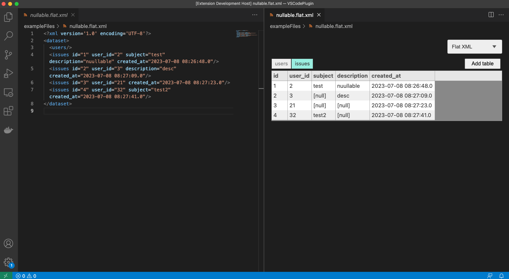
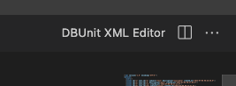
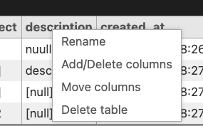
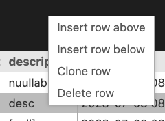

# vscode-dbunit-xml-editor

This extension allows you to edit xml dataset files with a table ui.

## Usage

Open a xml file. Click "DBUnit XML Editor" label.

Right-click on a header

Right-click on a row

## License

Code: MIT
